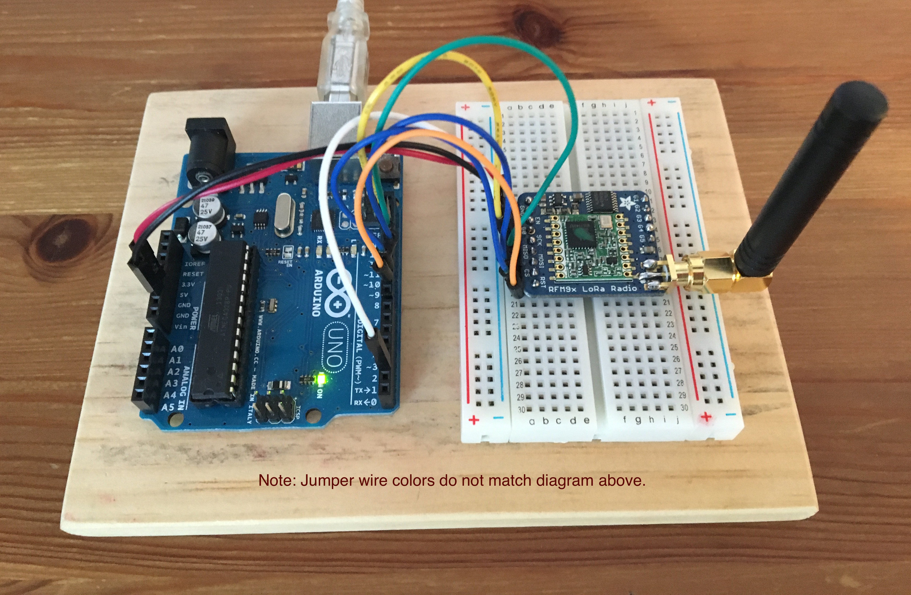
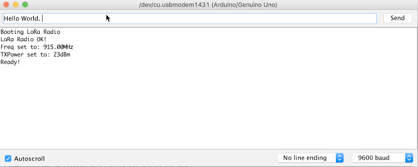

## LoRa Radio Transceiver Project

###Purpose

**NB - This project is not complete and the code is not yet tested or released. Once the project is deployable this note will be removed.**

This project enables two-way radio communication between clients using the Adafruit built [RFM95W LoRa Radio Transceiver Breakout](https://www.adafruit.com/products/3072) and the [RadioHead Packet Radio Library](http://www.airspayce.com/mikem/arduino/RadioHead/index.html).

###Parts List

Aside from the items listed below you'll also need a computer running the Arduino IDE version 1.6.9 or higher. Since this project is a radio communication project you'll need at least two builds in order to communicate (otherwise you're just sending messages into the aether). The approximate cost for a single radio is $70 US (not counting the computer). If you already have the Uno and just need the radio parts the cost is approximately $40 US.

*	Arduino/Genuino Uno x2
*	RFM95W LoRa Radio Tranceiver Breakout x2
*	Edge-Launch SMA Connector for 1.6mm / 0.062" Thick PCBs x2
*	Right-angle Mini GSM/Cellular Quad-Band Antenna - 2dBi SMA Plug x2
*	Half-Size Breadboard x2
*	Jumper Wire and USB Cables

###Deployment

TODO Steps will be written here once the project is tested and deployed.

###Hardware

